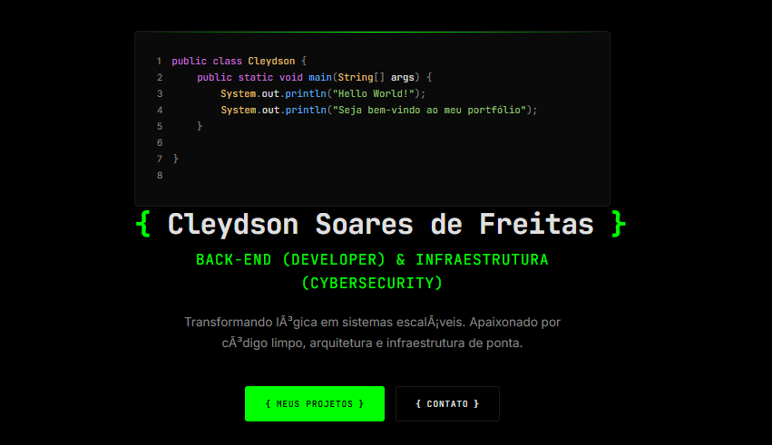

<div align="center">

# { Portfólio - Cleydson Soares de Freitas }

> **Back End Developer** | **DevSecOps & Purple Team** | **Segurança da Informação**

Portfólio pessoal desenvolvido com foco em performance, acessibilidade e estética cyberpunk/hacker. Projeto estático, sem dependências de build, pronto para deploy em qualquer hosting estático.

[]()
[]()

</div>

> ⚠️ **Nota:** Este é um projeto pessoal e serve apenas como referência/inspiração. Não estou aceitando contribuições diretas, mas você pode fazer um fork e adaptá-lo ao seu gosto seguindo a licença MIT.

---

<p align="center">
  
</p>

<p align="center">
  <a href="https://cleydson-portfolio.netlify.app" target="_blank">
    
  </a>
  <a href="https://github.com/cleydsonsfreitas" target="_blank">
    
  </a>
  <a href="https://www.linkedin.com/in/cleydsonfreitas/" target="_blank">
    
  </a>
</p>

---

## 📋 Índice

- [Sobre o Projeto](#-sobre-o-projeto)
- [Tecnologias Utilizadas](#-tecnologias-utilizadas)
- [Funcionalidades](#-funcionalidades)
- [Projetos em Destaque](#-projetos-em-destaque)
- [Layout e Design](#-layout-e-design)
- [Como Usar Este Projeto](#-como-usar-este-projeto)
- [Estrutura do Projeto](#-estrutura-do-projeto)
- [Acessibilidade](#-acessibilidade)
- [Performance e Segurança](#-performance-e-segurança)
- [Formação & Certificações](#-formação--certificações)
- [Deploy](#-deploy)
- [Licença](#-licença)
- [Contato](#-contato)

---

## 🚀 Sobre o Projeto

Portfólio pessoal desenvolvido para apresentar projetos e habilidades nas áreas de **Back-End, DevSecOps e Segurança da Informação**. O projeto foi construído de forma puramente estática (Vanilla Web), garantindo altíssima velocidade, segurança e facilidade de hospedagem, sem a necessidade de frameworks complexos ou processos de build.

---

## 🛠 Tecnologias Utilizadas

| Categoria | Tecnologias |
|-----------|-------------|
| **Linguagens** | Java, Python, C# |
| **Backend** | Spring Boot, FastAPI, .NET Core |
| **Segurança** | DevSecOps, Purple Team, Pentest, SAST/DAST, SDLC Seguro |
| **Infraestrutura** | Docker, Kubernetes, Terraform, AWS, Linux/Kali |
| **CI/CD** | GitHub Actions, GitLab CI, Jenkins |
| **Ferramentas** | Burp Suite, OWASP ZAP, Nmap, Metasploit, Wireshark |

---

## ⚙️ Funcionalidades

- **Apresentação Hacker:** Design imersivo com tema dark e detalhes em neon.
- **Efeitos Dinâmicos:** Animações de digitação (typing effects) e cubo mágico animado (`.gif`).
- **Navegação:** Smooth scroll fluído entre as seções do site.
- **Responsividade:** Layout 100% adaptável para desktops, tablets e smartphones usando Flexbox e CSS Grid.

---

## 🎯 Projetos em Destaque

| Projeto | Descrição | Tech Stack |
|---------|-----------|------------|
| **Desafio 30** | 30 projetos práticos (fácil/médio/difícil) em Java, Python, C# focados em lógica e secure coding | Java, Python, C#, Secure SDLC |
| **Automação de Varredura** | Pipeline CI/CD com SAST/DAST (OWASP ZAP, Trivy, Semgrep) para apps containerizadas | Python, Docker, GitHub Actions |
| **Laboratório de Redes Seguro** | Ambiente isolado Kali Linux para simulação de ataques e validação de regras de detecção | Kali Linux, Suricata, Zeek, Wireshark |

---

## 🎨 Layout e Design

O design system do projeto foi construído utilizando variáveis CSS puras, garantindo fácil manutenção e um visual coeso focado na estética Cyberpunk.

| Token | Valor | Uso |
|-------|-------|-----|
| `--bg` | `#000000` | Background principal |
| `--bg-elevated` | `#0a0a0a` | Cards, seções alternadas |
| `--bg-deep` | `#050505` | Footer |
| `--fg` | `#e0e0e0` | Texto principal |
| `--fg-muted` | `#888888` | Texto secundário |
| `--accent` | `#00cc66` | Destaques, links, bordas (verde neon) |
| `--accent-dim` | `#009944` | Hover states |
| `--border` | `#1a1a1a` | Divisores, bordas sutis |

**Tipografia:**
- **Títulos/Code:** `JetBrains Mono` (monoespaçada)
- **Corpo:** `Inter` (sans-serif)

---

## 🚦 Como Usar Este Projeto

Como este é um projeto estático puro (HTML/CSS/JS vanilla), ele **não requer** Node.js, npm, Docker ou qualquer processo de build para rodar localmente.

1. **Clone o repositório:**
```bash
git clone [https://github.com/cleydsonsfreitas/meu-portfolio-tech.git](https://github.com/cleydsonsfreitas/meu-portfolio-tech.git)
cd meu-portfolio-tech
